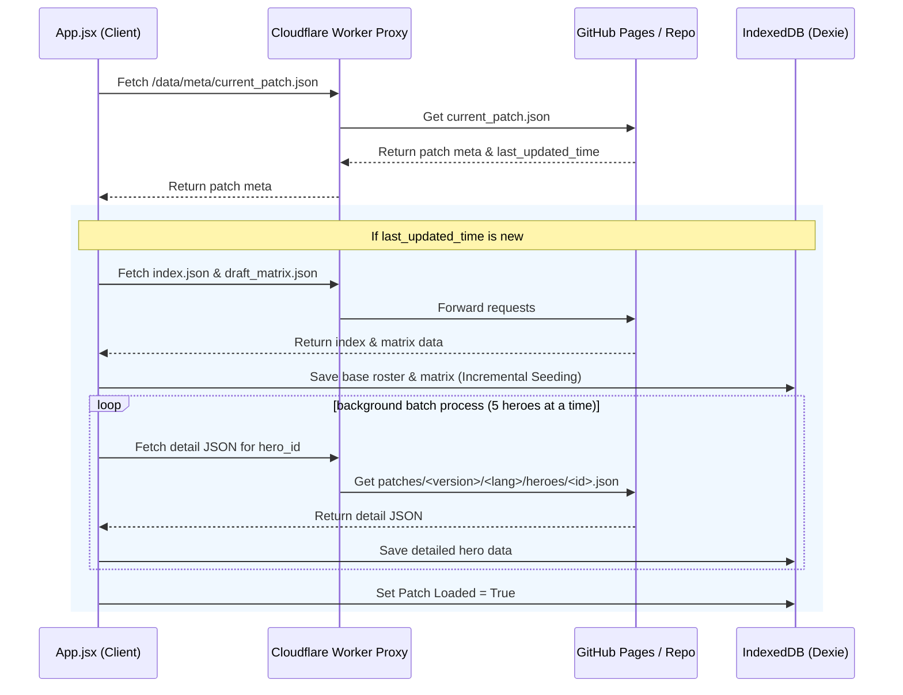

# Handover: MLBB Companion App OTA Update Architecture

This document provides a technical breakdown of the Over-the-Air (OTA) update mechanism implemented in the MLBB Companion App. It outlines how patches are detected, staged, validated, and applied transactionally to IndexedDB.

---

## 1. System Overview

---

## 2. Key Components & Implementation Files

### A. Client Entrypoint: `src/App.jsx`
- **Location:** [App.jsx](file:///c:/Users/rosha/Documents/MLBB/src/App.jsx)
- **Role:** Coordinates boot lifecycle, detects updates, and initiates seeding.
- **Update Checking:**
  - Connects to the Worker URL configured in `REMOTE_UPDATE_BASE_URL` (`https://mlbb-ota-proxy.linkdaddy0.workers.dev`).
  - Fetches `/data/meta/current_patch.json` to extract `current_patch` version and `last_updated_time`.
  - Compares the `last_updated_time` against local storage (`mlbb_patch_last_updated_<version>_<lang>`).
  - If a discrepancy is found (indicating a new deployment), it sets the patch state to not loaded in the repository, forcing a full database re-seed.

### B. Patch Seeding: `src/database/db.js`
- **Location:** [db.js](file:///c:/Users/rosha/Documents/MLBB/src/database/db.js)
- **Class:** `BackgroundSeeder`
- **Role:** Handles non-blocking seeding of the SQLite-equivalent database (IndexedDB) in web environments.
- **Details:**
  - Implements concurrency-limited batching (5 items per batch, 300ms intervals) to download full hero detail JSON files from the remote worker.
  - Keeps the main UI thread completely responsive during seeder activation.
  - Implements **Self-Healing Verification**: On start, it checks hero ID 1 (Miya) for offline-local compliance (e.g. checks if cover images are transparent and no online HTTP URLs exist in local state). If non-compliant, it clears the tables and forces a clean seeder rebuild.

### C. Transaction Manager: `src/services/PatchManager.js`
- **Location:** [PatchManager.js](file:///c:/Users/rosha/Documents/MLBB/src/services/PatchManager.js)
- **Role:** Supports transactional updates and rollback options.
- **Details:**
  - Exposes `installPatch(version, lang, apiBaseUrl)` and `rollbackPatch(version, lang)`.
  - Stages all downloads first, validates them against Zod schemas, and performs a single transactional `Dexie` commit. If any step fails, the entire transaction is aborted, preventing corrupt/partial datasets.

---

## 3. Remote Cache Proxy Configuration

The proxy is hosted as a **Cloudflare Worker** at:
`https://mlbb-ota-proxy.linkdaddy0.workers.dev`

It performs two routing tasks:
1. **`/data/` requests:** Serves Compiled Static JSON assets directly from the repository's main branch (`https://raw.githubusercontent.com/linkdaddy0-dev/mlbb/main/public/data/`).
2. **`/moonton/` requests:** Proxies legacy endpoints to Moonton server with user-agent mapping to bypass local geo-blocks.

---

## 4. Troubleshooting & Handover Checklist

1. **Forced Refresh:** To force the client app to discard IndexedDB and query the OTA server fresh, update the `last_updated_time` timestamp in `public/data/meta/current_patch.json`.
2. **Offline Mode:** If the Worker is offline or slow, the boot lifecycle automatically falls back to `./data/fallback_roster.json` and `./data/fallback_matrix.json`, ensuring the app never soft-bricks.
