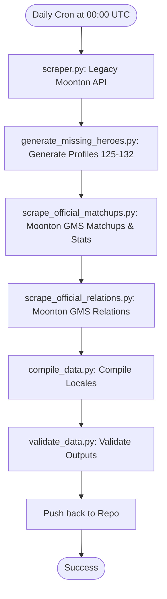

# Official Daily Sync: Pipeline & Scraper Engine

This document provides a technical overview of the scraping, metrics extraction, compilation, and validation pipeline that runs daily on GitHub Actions.

---

## 1. Scraping and Synchronization Pipeline

---

## 2. Scraper Script Breakdown

### A. Core Details Crawler: `scraper.py`
- **Location:** [scraper.py](file:///c:/Users/rosha/Documents/MLBB/scraper.py)
- **API Target:** `mapi.mobilelegends.com` (legacy portal).
- **Note on geoblocking:** the scrapers call Moonton **directly**, not through the
  Cloudflare Worker. This works because GitHub Actions runners are outside the
  blocked region — the Worker proxy exists for the *app*, not for CI, and the
  maintainer's local VPN only matters when running these scripts by hand. If
  Moonton ever blocks GitHub's IP ranges, point the scrapers at the Worker's
  `/official/gms/source/<project>/<source>` route, which already forwards with
  the correct `Origin`/`Referer` headers.
- **Output:** Dumps raw profiles (`hero_<id>.json`) into `data/raw/{lang}/` for 7 locales: `en`, `id`, `es`, `pt`, `ru`, `tr`, `tl`.
- **Fallback:** If Moonton's server is down, it uses a fallback scraping crawler targeting the community wiki API (`mlbb-wiki-api.vercel.app/api/heroes`).

### B. Missing Heroes Generator: `scripts/generate_missing_heroes.py`
- **Location:** [generate_missing_heroes.py](file:///c:/Users/rosha/Documents/MLBB/scripts/generate_missing_heroes.py)
- **Role:** The legacy Moonton API only returns 124 heroes. suyuo (126), Zhuxin (125), and IDs 127-132 are missing.
- **Output:** Synthesizes standard Moonton-compliant profile mockups for IDs 125-132 and registers them inside `data/avatar_map.json` and `src/data/hero_meta_stats.json`.

### C. Live Matchups & Metrics Extractor: `scripts/scrape_official_matchups.py`
- **Location:** [scrape_official_matchups.py](file:///c:/Users/rosha/Documents/MLBB/scripts/scrape_official_matchups.py)
- **GMS API Target:** `https://api.gms.moontontech.com/api/gms/source/2713644/2777391`
- **Roles:**
  1. **Daily Stat Updates:** Fetches live Moonton GMS records, extracts daily performance metrics (`main_hero_win_rate`, `main_hero_pick_rate`, `main_hero_ban_rate`), and updates `src/data/hero_meta_stats.json`.
  2. **Draft Matchups:** Analyzes hero vs hero performance data by rank tiers (prioritizing big_rank `101` - Mythic+), calculating synergy and counter scores (sorted by win-rate influence), and saving the finalized matchups to `data/official_matchups.json`.

### D. Relations Crawler: `scripts/scrape_official_relations.py`
- **Location:** [scrape_official_relations.py](file:///c:/Users/rosha/Documents/MLBB/scripts/scrape_official_relations.py)
- **GMS API Target:** `https://api.gms.moontontech.com/api/gms/source/2713644/2766683`
- **Output:** Fetches official relation descriptions (synergy, counter, and weakness reasons) and saves them in `data/official_relations.json`.

---

## 3. Compilation & Validation

- **Compiler (`compile_data.py`):**
  - Reads raw JSON hero files from `data/raw/{lang}/`.
  - Integrates descriptions from `data/official_relations.json`.
  - Links win rate and ranking values from `src/data/hero_meta_stats.json`.
  - Normalizes relative asset paths to absolute offline WebP candidates.
  - Outputs finalized minified guides and search indexes under `public/data/patches/2.1.18/{lang}/`.

- **Validator (`validate_data.py`):**
  - Parses compiled outputs across all 7 locales.
  - Verifies that zero duplicate hero IDs exist, and checks that builds, skills, and matchup matrices satisfy JSON schemas.
